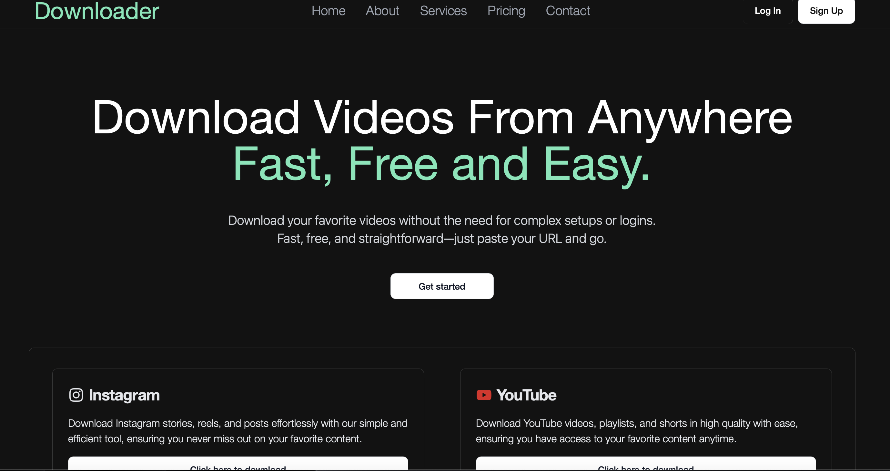
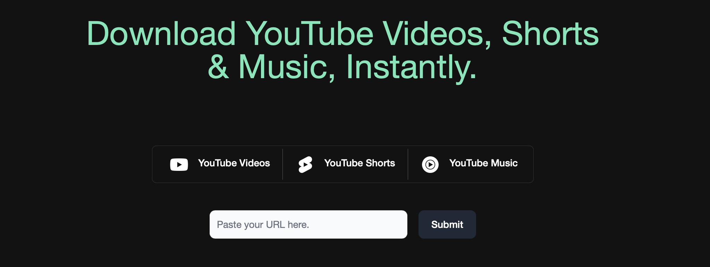

# Video Downloader

A powerful video downloader that allows users to download videos from popular platforms like YouTube, Instagram, TikTok, and Twitter.

## Features
- **Multiple Platforms**: Download videos from YouTube, Instagram, TikTok, and Twitter.
- **Easy to Use**: Simple URL input and download functionality.
- **Configurable**: Select video quality and download path.

## Tech Stack
- **Backend**: Node.js, Express.js
- **APIs**: `@distube/ytdl-core` for YouTube, Cheerio for Instagram, TikTok and Twitter APIs for respective downloads.

## Installation
1. Clone the repository:
   ```bash
   git clone https://github.com/yourusername/video-downloader.git
   ```
2. Install dependencies:
   ```bash
   npm install
   ```
3. Configure environment variables in a `.env` file.
4. Start the server:
   ```bash
   npm run start:dev
   ```

## Usage
- Paste the URL of the video you want to download.
- Select desired quality and click **Download**.
- The video will be saved to the specified folder.

## Screenshots
### Home Page


### Download Example


## License
MIT License

## Contact
Created by [Satyam Kumar](https://github.com/yourusername)
